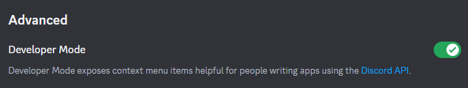

# discord-message-purger
A Discord message purging tool, which can be used to delete all messages (including message replies) with a specific user, or in a specific channel.

**Note:** Automating user accounts is against Discord's Terms of Service. 

# Usage - Python 
1. Install the latest version of Python3.
2. Install the requirements: `pip install asyncio discord discord.py-self`
3. Run the script: `python3 purger.py`
4. Select option `1` or `2` for purging messages with a user or channel.
5. Enter your Discord token.
6. Enter the Channel ID or User ID.

## Discord Token Retrieval

You can get your discord token by pressing ctrl-shift-i on the Discord website, going to console and copy pasting this:
`allow pasting`
`(
    webpackChunkdiscord_app.push(
        [
            [''],
            {},
            e => {
                m=[];
                for(let c in e.c)
                    m.push(e.c[c])
            }
        ]
    ),
    m
).find(
    m => m?.exports?.default?.getToken !== void 0
).exports.default.getToken()`

## Server ID and User ID Retrieval
1. Enable `Developer Mode` within `User Settings` and subheading `Advanced`.
2. Right click the desired server channel and select `Copy Channel ID`.
3. Right click the desired user's direct messages and select `Copy User ID`

